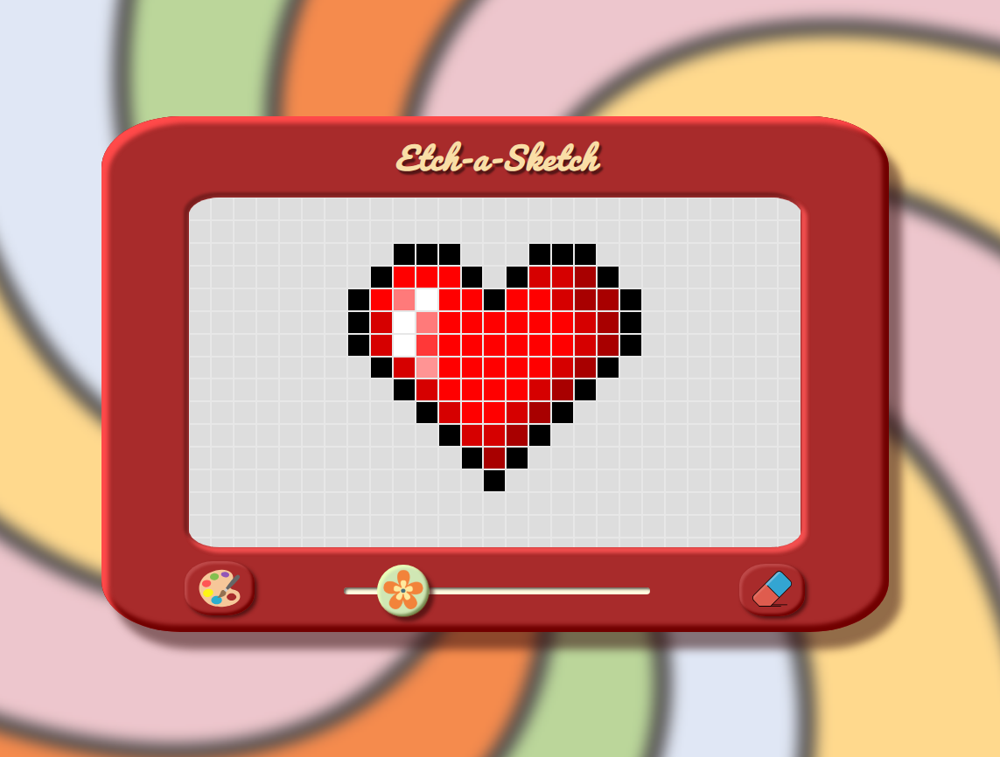

# 🌸 Etch-a-Sketch

A creative drawing tool inspired by the classic Etch-a-Sketch toy, built with HTML, CSS, and JavaScript. You can draw, change colors, erase, or reset — all in a clean and playful design.

## ✨ Features

- 🎨 Select a color with the color picker
- 🧼 Erase with a click
- 📐 Change grid size using the flower-shaped slider
- 🖱️ Draw by dragging the mouse over the squares

## 🧾 How it works

- **Color Selection:** Choose the current color to draw with.
- **Erase:** Switches to an eraser – click again to go back to drawing.
- **Grid:** The slider changes the grid size (from 16 to 100 squares).